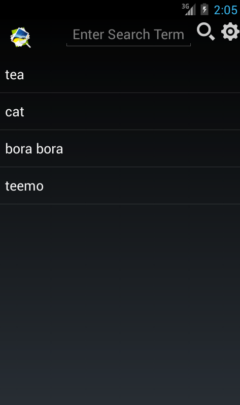
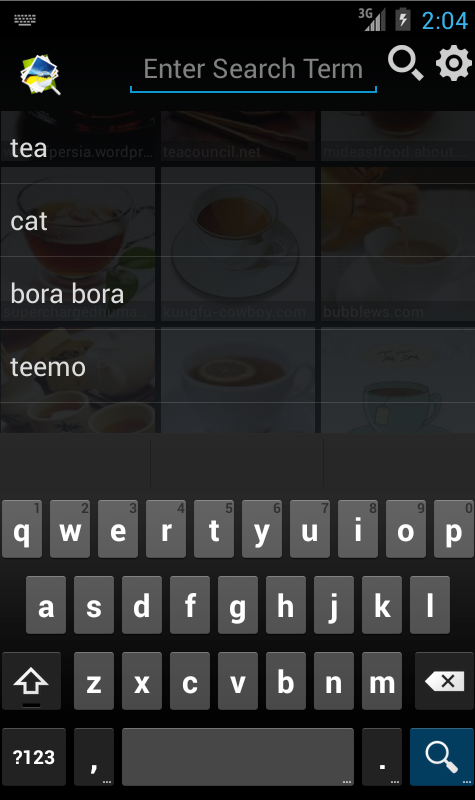
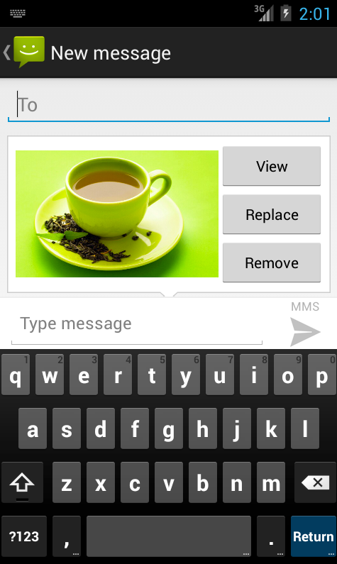

cpath-image-search
==================

TheCodePath: Grid Image Search App

Sample Images:

Completed Stories:
* User can enter a search query that will display a grid of image results from the Google Image API.
* User can click on "settings" which allows selection of advanced search options to filter results
* User can configure advanced search filters
* Subsequent searches will have any filters applied to the search results
* User can tap on any image in results to see the image full-screen
* User can scroll down “infinitely” to continue loading more image results (up to 8 pages)
* Optional: User can share an image to their friends or email it to themselves
    -- partial: On the phone, sharing photos work fine but on the emulator, the attached photo doesn't change from the first photo that was attached.
* Optional: Robust error handling, check if internet is available, handle error cases
    -- partial: Handle cases for:
        * empty search query
        * no internet
        * overly-large image size that causes out of memory crash
        * exceptions thrown when displaying fullUrl image (and use thumbUrl instead of fullUrl when this happens)
* Optional: Improve the user interface and experiment with image assets and/or styling and coloring
  -- improve items inside GridView
  -- add description to full-screen view
  -- add history of previous searches
